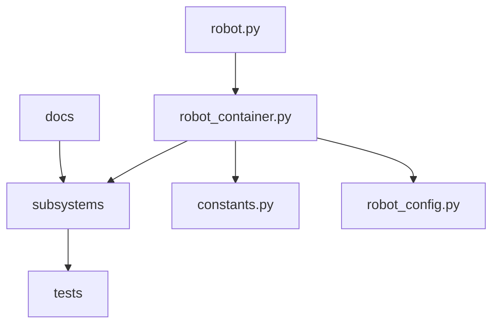

# Template Architecture

This project intentionally separates reusable structure from game-specific logic.

## Design rules

1. Keep game-specific constants and behaviors isolated.
2. Keep reusable subsystem patterns generic.
3. Build hardware interaction behind IO abstractions.
4. Require docs updates with behavior changes.